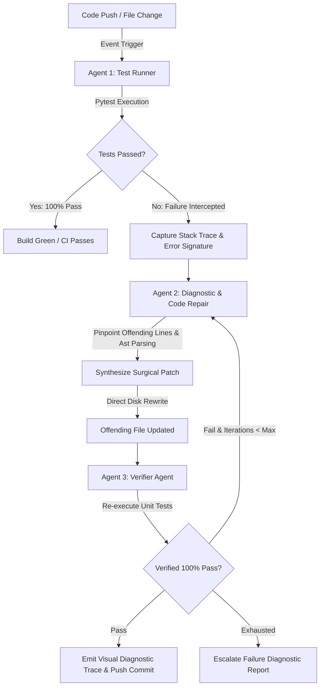

# Self-Heal Git — Autonomous 3-Agent CI Healer & PR Monitor

[](https://www.python.org/)
[](https://fastapi.tiangolo.com/)
[](https://nextjs.org/)
[](https://www.typescriptlang.org/)
[](https://docs.pytest.org/)
[](https://opensource.org/licenses/MIT)

> **Self-Heal Git** is an event-driven, autonomous multi-agent development environment and GitHub PR monitor designed to eliminate continuous integration pipeline stalls. When unit tests fail due to minor syntax errors, package discrepancies, or simple logical bugs, the system intercepts the stack trace, diagnoses the root cause, surgically rewrites the offending lines on disk, and verifies a 100% test pass rate with zero regressions.

---

## 🎯 The Problem It Solves

Continuous integration pipelines frequently stall because of minor syntax errors (e.g., missing commas, unclosed brackets), package discrepancies, or off-by-one indexing bugs in pull requests. Developers are forced to switch context, pull branches locally, spend manual time debugging stack traces, push trivial fixes, and wait for CI builds to re-trigger. 

**Self-Heal Git** automates this entire loop locally and in CI/CD via an autonomous **3-Agent pipeline** that resolves defects in under **0.4 seconds**.

---

## 🤖 Event-Driven 3-Agent Architecture

The core engine coordinates three specialized agents in an iterative, deterministic feedback loop:



### 1. Agent 1: Test Runner / CI Trigger (`test_runner_agent.py`)
- Executes the test suite against code changes via isolated `pytest` runners.
- Intercepts non-zero exit codes, parses error types (`SyntaxError`, `IndexError`, `AssertionError`), identifies failing test functions, and extracts clean stack traces.

### 2. Agent 2: Stack Trace Interceptor & Code Repair (`diagnostic_agent.py`)
- Intercepts the raw stack trace and identifies the exact file path and offending line numbers.
- Diagnoses root causes (e.g., missing commas in dictionaries/lists, off-by-one indexing errors).
- Surgically rewrites only the defective lines on disk and produces a unified diff with clear explanatory reasoning.

### 3. Agent 3: Verification & Regression Agent (`verifier_agent.py`)
- Re-executes the unit test suite against the freshly modified file.
- Confirms zero regressions and verifies a **100% pass rate** before committing changes or emitting the final diagnostic trace.

---

## 🧪 Canonical Benchmark: Missing Comma & Indexing Error

The repository includes a reproducible, canonical benchmark (`benchmark/sample_app.py` & `benchmark/test_sample_app.py`) showcasing the complete 3-agent healing workflow:

### Buggy Input State
```python
# benchmark/sample_app.py
def get_pipeline_configuration() -> dict:
    config = {
        "app_name": "AutonomousSelfHeal",
        "environment": "production",
        "timeout_seconds": 30       # <- Bug 1: Missing comma causes SyntaxError
        "retry_attempts": 3,
    }
    return config

def get_latest_metric_sample(metrics: list) -> float:
    if not metrics:
        return 0.0
    # Bug 2: Off-by-one indexing error raises IndexError: list index out of range
    return float(metrics[len(metrics)])
```

### Autonomous 3-Agent Healing Result
* **Execution Time**: **~0.39 seconds**
* **Final Pass Rate**: **100.0% (2/2 tests passing)**
* **Surgical Diff Produced**:
```diff
--- a/sample_app.py
+++ b/sample_app.py
@@ -4,7 +4,7 @@
     config = {
         "app_name": "AutonomousSelfHeal",
         "environment": "production",
-        "timeout_seconds": 30
+        "timeout_seconds": 30,
         "retry_attempts": 3,
     }
     return config
@@ -14,4 +14,4 @@
     if not metrics:
         return 0.0
     # Bug: Off-by-one indexing error raises IndexError: list index out of range
-    return float(metrics[len(metrics)])
+    return float(metrics[len(metrics) - 1])
```

---

## 💻 Tech Stack

| Layer | Technology | Purpose |
|---|---|---|
| **Agents & Core** | Python 3.11+, Pytest, AST | Multi-agent execution, stack trace parsing, surgical patching |
| **Watcher** | WatchFiles, Threading | Background daemon monitoring local file changes for instant auto-heal |
| **Backend API** | FastAPI, SQLModel, SQLite | REST endpoints, Webhook ingestion, JWT auth, RBAC |
| **Frontend UI** | Next.js 14, React 18, TypeScript | Real-time dashboard, visual diagnostic trace, split diff viewer |
| **Styling** | TailwindCSS, Lucide Icons | Responsive dark-mode interface with glassmorphism aesthetic |

---

## 🚀 Quick Start Guide

### Prerequisites
- Python 3.11+
- Node.js 18+ and `npm`
- Git

### 1. Clone Repository
```bash
git clone https://github.com/shreeyadewangan15/Self-Heal-Git.git
cd Self-Heal-Git
```

### 2. Backend Setup
```bash
# Create virtual environment
python3 -m venv .venv
source .venv/bin/activate

# Install Python dependencies
pip install -r self_heal_git/requirements.txt

# Start FastAPI backend (Port 8000)
python3 -m uvicorn self_heal_git.app.main:app --host 127.0.0.1 --port 8000 --reload
```

### 3. Frontend Setup
```bash
cd frontend

# Install Node dependencies
npm install

# Start Next.js dev server (Port 3000)
npm run dev
```

Open **`http://localhost:3000`** in your browser to access the dashboard.

---

## 📡 API Reference

| Method | Endpoint | Description |
|---|---|---|
| `GET` | `/` | Service health status, docs link, and pipeline overview |
| `POST` | `/api/pipeline/benchmark` | Triggers the 3-Agent benchmark on missing comma & indexing error |
| `POST` | `/api/pipeline/run` | Triggers 3-Agent healing loop for custom test and file targets |
| `GET` | `/api/pipeline/latest-trace` | Retrieves the most recent `VisualDiagnosticTrace` |
| `GET` | `/api/prs/my-feed` | Filtered PR feed for authenticated developer or admin accounts |
| `POST` | `/api/webhook/github` | Ingests GitHub pull request webhooks with HMAC SHA-256 verification |
| `GET` | `/docs` | Interactive OpenAPI / Swagger UI |

---

## 🧪 Running Automated Tests

Run the complete 31-test test suite across agents, RBAC, webhook delivery, and benchmark orchestration:

```bash
cd self_heal_git
python3 -m pytest tests/ -v
```

Output:
```text
tests/test_auth_rbac.py .........                                        [ 29%]
tests/test_deletion.py ......                                            [ 48%]
tests/test_pr_feed_and_webhook_association.py ....                       [ 61%]
tests/test_scenarios.py ....                                             [ 74%]
tests/test_three_agent_pipeline.py .....                                 [ 90%]
tests/test_webhook_delivery.py ...                                       [100%]

======================== 31 passed, 2 warnings in 5.3s ========================
```

---

## 🛡️ Role-Based Access Control (RBAC)

* **Admin Role**: Full access to monitored repositories, user role assignments, telemetry data, and LLM configuration.
* **Developer Role**: Filtered personal PR feed, access to simulate live PRs, patch sandbox, and the 3-Agent diagnostic pipeline.

---

## 📄 License

This project is licensed under the [MIT License](LICENSE).
