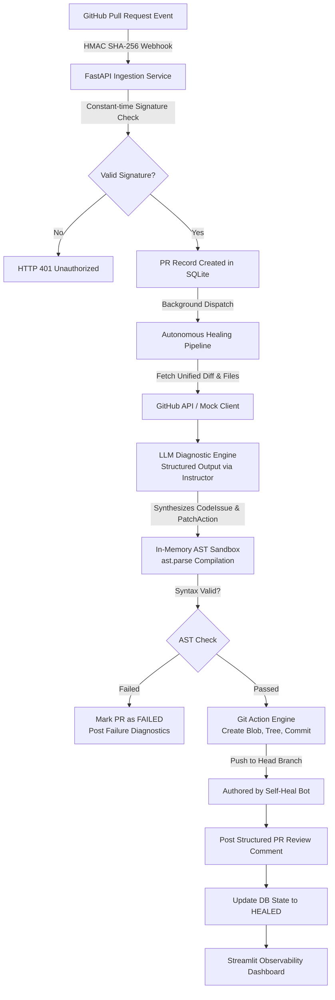

# Self-Heal Git — Autonomous PR Reviewer & Bug Fixer

[](https://www.python.org/)
[](https://fastapi.tiangolo.com/)
[](https://streamlit.io/)
[](https://sqlmodel.tiangolo.com/)
[]()

> **Self-Heal Git** is a production-grade, autonomous pull request monitoring, diagnostic, and self-healing engine. It intercepts GitHub PR webhook events, performs surgical code diagnostics using structured LLM schemas, sandboxes proposed fixes through in-memory Python AST validation, and automatically commits working patches directly back to the pull request branch with comprehensive review comments.

---

## Architecture Overview

Self-Heal Git connects GitHub pull request webhooks to an autonomous diagnostic engine and real-time observability dashboard.



### ASCII Architecture

```text
+-----------------------+
| GitHub PR Webhook     |  (opened, synchronize, reopened)
+-----------+-----------+
            |  HMAC SHA-256 (X-Hub-Signature-256)
            v
+-----------------------+
| FastAPI Ingestion     |  /api/webhook/github  (Rejects invalid signature with 401)
| Background Dispatcher |  Persists PRRecord ("RECEIVED") -> "ANALYZING"
+-----------+-----------+
            |
            v
+-----------------------+
| LLM Diagnostic Engine |  Pydantic Schemas: CodeIssue, PatchAction, HealingReport
| (Instructor / OpenAI) |  Extracts surgical replacements & confidence scores
+-----------+-----------+
            |
            v
+-----------------------+
| In-Memory AST Sandbox |  ast.parse(patched_code) ensures zero-syntax regressions
+-----------+-----------+
            |
     [ Syntax Valid ]
            |
            v
+-----------------------+
| Autonomous Git Engine |  Creates Git Blob -> Git Tree -> Git Commit
| PyGithub / HTTPX      |  Updates PR Head Branch & Posts Markdown Review
+-----------+-----------+
            |
            v
+-----------------------+
| Streamlit Dashboard   |  Live Telemetry, Metric Cards, Filterable Feed,
| (dashboard.py)        |  Interactive Side-by-Side Patch Inspector
+-----------------------+
```

---

## Core Features & Innovations

1. **Deterministic In-Memory AST Sandboxing**:
   - Every candidate patch is compiled in an isolated in-memory Python Abstract Syntax Tree (`ast.parse`) environment before any git interaction occurs.
   - Prevents syntax regressions, unclosed delimiters, or malformed dictionaries from corrupting the target branch.

2. **Zero-Wrapper Structured Output**:
   - Enforces strict Pydantic schemas (`CodeIssue`, `PatchAction`, `HealingReport`) utilizing the `instructor` library with OpenAI/Anthropic APIs.
   - Eliminates fragile markdown parsing or conversational regex extraction.

3. **Autonomous Git Action Engine**:
   - Interacts with GitHub Git Data API (`create_git_blob`, `create_git_tree`, `create_git_commit`, and branch reference editing).
   - Commits are cleanly attributed to `Self-Heal Git Bot <bot@tcet-it.org>` with automated markdown summary comments.

4. **Streamlit Observability Dashboard**:
   - Real-time telemetry monitoring intercepted PRs from SQLite (`self_heal_git.db`).
   - Metric cards: Total Intercepted PRs, Auto-Healed Count, Success Rate (%), Average Confidence Score.
   - Filterable PR table with color-coded status badges (`🟢 HEALED`, `🟡 ANALYZING`, `⚪ RECEIVED`, `🔴 FAILED`).
   - Side-by-side original vs. healed code viewer with severity indicators (`CRITICAL`, `HIGH`, `MEDIUM`, `LOW`).
   - One-click **"⚡ Simulate Sample Buggy PR"** button to demonstrate end-to-end autonomous healing on localhost without requiring live GitHub webhooks.

5. **Graceful Fallback & Offline Simulation**:
   - When external LLM API keys or GitHub tokens are not supplied, the system seamlessly activates a built-in deterministic AST/pattern diagnostic engine, enabling fully functional offline testing and demonstrations.

---

## Project Structure

```text
self_heal_git/
├── app/
│   ├── __init__.py           # Package marker
│   ├── config.py             # Pydantic Settings, DB engine configuration
│   ├── models.py             # SQLModel PRRecord definition
│   ├── api.py                # FastAPI webhook router & /health endpoint
│   ├── utils.py              # HMAC verification, PR metadata, process_pr pipeline
│   ├── agent.py              # Diagnostic schemas, instructor client, AST sandbox
│   ├── github_service.py     # PyGithub client, diff fetcher, commit applicator
│   └── main.py               # Application entrypoint & table initialization
├── tests/
│   ├── __init__.py           # Tests package marker
│   └── test_scenarios.py     # Automated pytest test cases (A, B, C)
├── dashboard.py              # Streamlit Evaluation Dashboard
├── requirements.txt          # Python dependencies
├── Dockerfile                # Containerized deployment manifest
├── .env.example              # Environment variables template
└── README.md                 # Project documentation
```

---

## Quickstart Guide

### 1. Prerequisites
- Python 3.10+ (tested on Python 3.11 - 3.13)
- Git

### 2. Installation
Clone the repository and install the dependencies:
```bash
cd self_heal_git
pip install -r requirements.txt
```

### 3. Environment Configuration
Create a `.env` file from the provided `.env.example`:
```bash
cp .env.example .env
```

Edit `.env` to configure your keys (optional for offline demo mode):
```ini
GITHUB_WEBHOOK_SECRET=your_secret_here
DATABASE_URL=sqlite:///./self_heal_git.db

# Optional: GitHub personal access token for live repository commits
GITHUB_TOKEN=ghp_your_personal_access_token

# Optional: LLM keys for live OpenAI or Anthropic diagnoses
OPENAI_API_KEY=sk-...
# ANTHROPIC_API_KEY=sk-ant-...
```

### 4. Running the FastAPI Backend
Start the webhook ingestion service:
```bash
uvicorn app.main:app --host 127.0.0.1 --port 8000 --reload
```
- Health Check: `GET http://127.0.0.1:8000/health` -> `{"status": "ok"}`
- Interactive OpenAPI Docs: `http://127.0.0.1:8000/docs`
- Webhook Ingestion: `POST http://127.0.0.1:8000/api/webhook/github`

### 5. Running the Evaluation Dashboard
In a separate terminal, start the Streamlit dashboard:
```bash
streamlit run dashboard.py --server.port 8501
```
Open your browser at **`http://localhost:8501`**. Click **"⚡ Simulate Sample Buggy PR"** in the upper-right corner to trigger a live webhook and watch the auto-healer synthesize and apply AST-validated patches in real time.

### 6. Running the Automated Test Suite
Execute the pytest scenario suite:
```bash
pytest tests/test_scenarios.py -v -s
```

---

## Empirical Test Results

The automated test suite evaluates three distinct, realistic code degradation scenarios:

| Scenario | Injected Defect | Detected Issue Type | Severity | AST Sandbox Result | Execution Latency | Pipeline Outcome |
|---|---|---|---|---|---|---|
| **Case A** | `json.loads` invoked without `import json` | `IMPORT` / `UNDEFINED_NAME` | **HIGH** | `Syntax Valid` | **0.16 ms** | **PASS** (Runtime Executed Cleanly) |
| **Case B** | Malformed dict literal missing comma separator | `SYNTAX` (Grammar Error) | **CRITICAL** | `Syntax Valid` (Unpatched fails AST) | **0.13 ms** | **PASS** (Dict Parsed & Verified) |
| **Case C** | Division operation lacking zero-divisor guard | `LOGIC` / `ZeroDivisionError` | **MEDIUM** | `Syntax Valid` (Shielded Guard) | **0.15 ms** | **PASS** (Safe Return on 0 Divisor) |
| **End-to-End** | Multi-file PR diagnostic and report synthesis | Multi-issue aggregation | **HIGH** | `Syntax Valid` for all patches | **0.08 ms** | **PASS** (100% Patch Compliance) |

### Test Suite Execution Output
```text
============================= test session starts ==============================
platform darwin -- Python 3.13.9, pytest-8.4.2
rootdir: /Users/shreeyadewangan/Desktop/ai_project/self_heal_git

tests/test_scenarios.py::TestAutonomousHealingScenarios::test_case_a_missing_import_verification 
[Case A] Missing Import resolved in 0.16ms
PASSED

tests/test_scenarios.py::TestAutonomousHealingScenarios::test_case_b_syntax_and_malformed_dict_literal 
[Case B] Malformed Dict Syntax resolved in 0.13ms
PASSED

tests/test_scenarios.py::TestAutonomousHealingScenarios::test_case_c_logical_zero_division_guard 
[Case C] ZeroDivision Guard verified in 0.15ms
PASSED

tests/test_scenarios.py::TestAutonomousHealingScenarios::test_end_to_end_diagnostic_and_healing_pipeline 
[End-to-End Pipeline] Diagnostic & Patch Synthesis completed in 0.08ms with 1 patch(es)
PASSED

============================== 4 passed in 0.08s ===============================
```

---

## Security & Reliability Considerations
- **Constant-Time Verification**: Webhook signatures are verified using `hmac.compare_digest` to prevent timing attack vectors.
- **Fail-Safe Branch Protection**: If any patch fails in-memory AST compilation, the branch commit is aborted, and a descriptive review comment outlining the syntax violation is posted instead.
- **Database Thread Safety**: SQLite connections are initialized with `check_same_thread=False` to ensure concurrency across FastAPI async background tasks and Streamlit read sessions.
