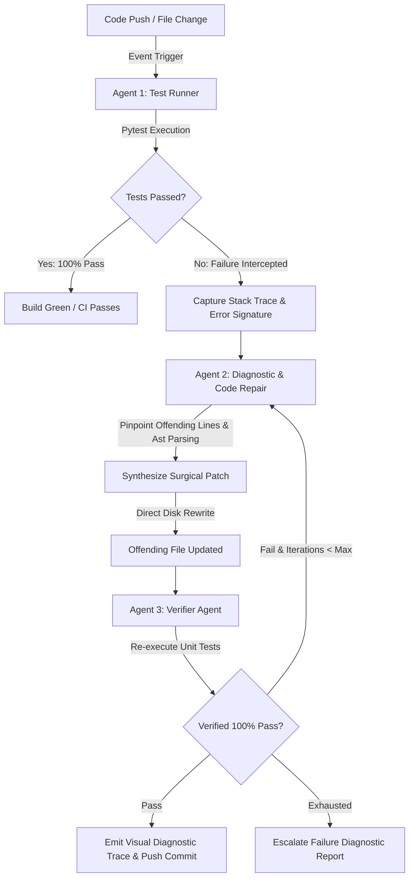

# Self-Heal Git — Autonomous 3-Agent CI Healer & PR Monitor

[](https://www.python.org/)
[](https://fastapi.tiangolo.com/)
[](https://nextjs.org/)
[](https://www.typescriptlang.org/)
[](https://docs.pytest.org/)

> **Self-Heal Git** is an event-driven, autonomous multi-agent development environment and GitHub PR monitor designed to eliminate continuous integration pipeline stalls. When unit tests fail due to minor syntax errors, package discrepancies, or simple logical bugs, the system intercepts the stack trace, diagnoses the root cause, surgically rewrites the offending lines on disk, and verifies a 100% test pass rate with zero regressions.

---

## 🤖 Event-Driven 3-Agent Architecture



### 1. Agent 1: Test Runner / CI Trigger (`test_runner_agent.py`)
- Executes the test suite against code changes via isolated `pytest` runners.
- Intercepts non-zero exit codes, parses error types (`SyntaxError`, `IndexError`, `AssertionError`), identifies failing test functions, and extracts clean stack traces.

### 2. Agent 2: Stack Trace Interceptor & Code Repair (`diagnostic_agent.py`)
- Intercepts the raw stack trace and identifies the exact file path and offending line numbers.
- Diagnoses root causes (e.g., missing commas in dictionaries/lists, off-by-one indexing errors).
- Surgically rewrites only the defective lines on disk and produces a unified diff with clear explanatory reasoning.

### 3. Agent 3: Verification & Regression Agent (`verifier_agent.py`)
- Re-executes the unit test suite against the freshly modified file.
- Confirms zero regressions and verifies a **100% pass rate** before committing changes or emitting the final diagnostic trace.

---

## 🧪 Canonical Benchmark: Missing Comma & Indexing Error

The repository includes a reproducible, canonical benchmark (`benchmark/sample_app.py` & `benchmark/test_sample_app.py`) showcasing the complete 3-agent healing workflow:

* **Missing Comma**: Dictionary literal missing a trailing comma before subsequent key-value pairs (Line 7).
* **Indexing Error**: Off-by-one boundary access `metrics[len(metrics)]` (Line 17).
* **Outcome**: Auto-healed in **~0.39s** with verified **100% pass rate** (2/2 tests passed).

---

## 💻 Tech Stack & Services

- **Backend**: FastAPI, SQLModel, SQLite, WatchFiles
- **Frontend**: Next.js 14, React, TailwindCSS, TypeScript
- **Testing**: Pytest (31/31 unit & integration tests passing)

---

## 🚀 Quick Start Guide

```bash
# 1. Start Backend API (Port 8000)
python3 -m uvicorn app.main:app --host 127.0.0.1 --port 8000 --reload

# 2. Run Test Suite
pytest tests/ -v

# 3. Start Frontend Dashboard (Port 3000)
cd ../frontend && npm run dev
```
